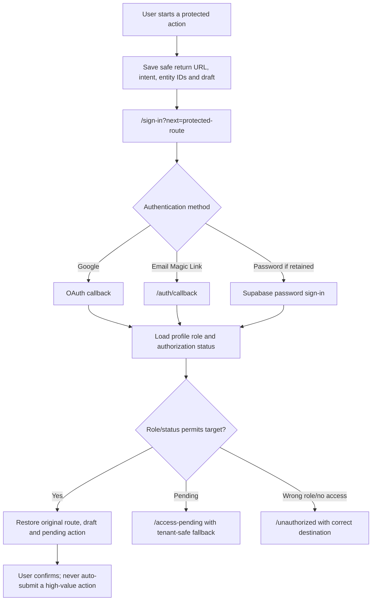
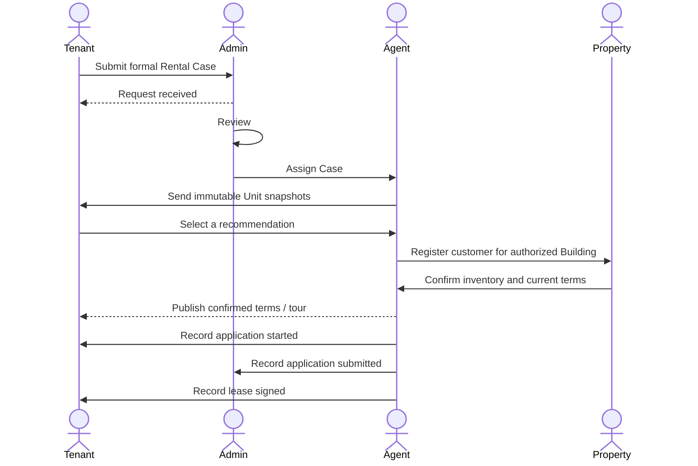

# 四角色 Sign In + Rental Case UX Flow 最终规格

| Field | Value |
| --- | --- |
| Review date | 2026-08-16 |
| Status | Draft for Product approval |
| Source commit | `5d5b9ea5af6015c0e0219974b73b9d8a0c47e970` |
| Release state | Candidate / `DEPLOYMENT PAUSED` / not production verified |
| Reviewer | `nyc-homes-ux-flow-designer` |

## 1. 一句话结论

当前候选已经建立较完整的四角色数据库授权、状态机和服务端动作边界，但用户可执行体验仍停留在“Tenant 可提交、各角色可看到最小只读页面”的阶段；在补齐 Case 深链接、推荐选择、三类运营操作界面、通知和恢复契约前，第一个真实客户不能仅靠现有界面走到 `lease_signed`。

## 2. Source of Truth 验证

审查开始时验证结果：

| Check | Result |
| --- | --- |
| Worktree | `C:\Users\Work-AI\Documents\纽约租赁网站\integration-four-role-rental-case` |
| Branch | `codex/four-role-rental-case` |
| HEAD | `5d5b9ea5af6015c0e0219974b73b9d8a0c47e970` |
| Expected parent | `80f9adfc258c4c41f0fd4a8905478049dbf3dbe3` |
| Worktree before review | Clean |
| Other Worktrees used as implementation facts | No |

本报告只以该 Commit 中的代码、文档和候选 migration 为事实。候选 migration 未部署、本地 Supabase SQL 测试未运行，因此数据库行为标记为“候选契约”，不是生产事实。

## 3. 用户真正要完成的任务与角色

Tenant 提交针对具体 Building/Unit 的正式租房需求，Admin 完成审核与 Agent 分配，Agent 基于真实库存发送不可变推荐，Tenant 选择具体推荐，Agent 向获授权 Property 登记，Property 确认库存并提供带看/申请入口，Agent/Admin 跟进申请并记录 `lease_signed` 或 `closed_lost`。

| Role | 身份来源 | 第一阶段目标 | 不得自行获得的权限 |
| --- | --- | --- | --- |
| tenant | 普通注册/首次 Profile，默认 `tenant` | 创建并跟踪自己的 Case | Agent、Property、Admin |
| agent | Admin 受保护授权，`active` | 处理被分配 Case | 其他 Agent Case、Property 官方库存写权 |
| property | Admin 授权角色 + Organization membership + Building Access | 处理授权 Building 的 Registration | 其他 Building、Tenant 其他活动、Agent 内部信息 |
| admin | 既有 Admin 通过受保护入口授权 | 审核、分配、授权、异常处理 | 自改授权、移除最后一个 Admin |

Property 内部不分级；Leasing Team 不是第五个角色。

## 4. 当前实现事实摘要

### 已实现并有代码证据

- `/sign-in` 支持 Google OAuth、密码及 Email Magic Link；`next` 只接受单斜杠开头的站内路径。
- `/auth/callback` 交换 Magic Link code，成功后返回安全 `next`；失败说明链接无效、过期或已使用。
- Tenant 可以在 `/rent-request` 登录前填写，并在点击提交时把草稿保存到同设备 `localStorage`；登录后返回原 URL 并读取草稿。
- 整租提交先创建 Inquiry，再调用 tenant-only RPC 创建独立 Rental Case。
- Candidate schema 定义四角色、Profile 自我提权防护、最后一个 Admin 保护、Case participant RLS、13 状态、历史与审计。
- Agent recommendation API 写入发送时价格/优惠/库存时间快照；表无 UPDATE/DELETE UI/RPC。
- Property Invitation 使用随机 token、SHA-256 hash、48 小时过期，并检查已使用、撤销、邮箱与 Building Access。
- `/cases/[id]`、`/agent/cases/[id]`、`/admin/cases/[id]` 能使用同一只读 Case workspace 展示状态、推荐和历史。
- `/admin/rental-cases` 提供只读 Case 队列；非 Admin 跳转 `/unauthorized`。

### 已实现但 UX 不完整

- Case workspace 显示数据库状态经下划线替换后的英文词和内部 Case UUID，没有用户状态文案、下一步、负责人或动作。
- Sign In 能返回 `next`，但 Session 过期后的 Case 错误按钮只去 `/sign-in`，未保留当前 Case URL。
- Property invitation 能验证并跳转 Registration，但 token 消费后没有可发现、可恢复的持久 Property 待办入口。
- `/access-pending` 和 `/unauthorized` 存在，但没有统一角色路由器根据 `authorization_status` 和目标路由自动选择。
- 推荐快照显示 gross/net effective rent 和发送时间，但没有解释计算、lease term、concession、available date、freshness/过期状态。

### 部分实现

- Tenant 提交成功只显示“Rental Case created”并链接 Inquiry 列表；API 不把 Rental Case ID 返回给表单，因此不能直达 `/cases/[id]`。
- `/dashboard/requests/[id]` 使用 Inquiry ID，并仍期待旧响应字段 `options`；新 API 返回 `recommendations/history/registrations`，该页面与新契约不一致。
- Agent、Property、Admin mutation API/RPC 存在，但没有可执行表单或状态动作 UI。
- 状态历史可供 participant 读取；Admin audit log 没有用户界面。
- Property contact consent 数据列存在且默认 false，但 Tenant 表单没有 consent 控件，Property 页面也没有条件披露界面。

### 仅数据库/API 支持，没有用户界面

- Admin review、Agent assignment、角色授权和 Building Access。
- Agent 创建推荐快照、Property Registration 和邀请。
- Tenant `interested`、Agent/Admin application/closure transitions。
- Property 确认库存、价格、优惠、带看和申请入口。
- `closed_lost`、`cancelled` 原因要求、状态历史和审计详情。

### 当前缺失

- Agent Case 列表/通知入口、Property Registration 操作表单、Admin assignment/review 表单。
- Tenant 对某一 recommendation 的 Interested / Not Interested / Select Unit 动作和选择事实。
- 跨角色通知（除 Property invitation webhook）。
- 填写过程自动保存、重复提交/idempotency key、提交不确定结果恢复。
- SLA、超时、无人响应、库存失效、价格变化的用户流程。
- 角色级登录后默认深链接与“继续上次待办”。

## 5. 共享 Sign In Flow

### 推荐流程

### UX 契约

- `next`：只允许站内绝对路径；拒绝 `//`、协议 URL 和未知 host。现有代码已满足基础校验。
- Intent：保存 `action`、Building ID、Unit ID、Case/Registration ID、来源页面和创建时间；不得只靠可篡改展示 query 表达事实。
- Draft：输入变化后 500–1000ms 节流保存；显示“Saved on this device at HH:MM”。敏感字段明确本机存储范围和清除入口。
- Callback：认证后先加载 Profile，再决定目标；不要默认把 Agent/Property/Admin 送到 Tenant Dashboard。
- 高价值动作：登录后恢复到确认态，不自动提交 Case、Interest、推荐、登记、授权或状态转换。
- Session expired：显示“Your session expired. Your work is saved.”，CTA 为“Sign in and continue”，`next` 必须是当前精确路由。
- Magic Link 跨设备：说明“此设备上的未提交草稿不会自动出现在另一设备”；Case/Invitation 服务端状态仍可恢复。
- Magic Link 过期/重复使用：提供“Send a new link”并保留安全 `next`；当前 callback 只有错误文字，需补 CTA。
- 取消登录：返回原公开页面/草稿，不清除输入；提供“Continue browsing”。
- Sign out：清除 session，不删除明确标记的本机草稿；受保护页立即停止显示私有数据。

## 6. Tenant Flow

### 目标路径

1. 从结果卡、Building Detail 或 Unit CTA 进入统一 Rental Case intake，页面从可信 Building/Unit ID 加载上下文。
2. 未登录填写最小需求；字段变更自动保存，显示本机保存状态。
3. 点击“Continue securely”时保存 intent/draft 并登录；返回原表单确认。
4. 提交使用 idempotency key；成功响应返回 `caseId`、用户状态、下一负责人和预期时间。
5. 直接进入 `/cases/{caseId}`，显示“Request received — NoFeeGo is reviewing it”。
6. 收到推荐后查看具体 Unit 快照：gross rent、net effective rent、计算说明、lease term、concession、available date、source checked at、validity warning。
7. 对每个推荐选择 `Interested` 或 `Not interested`；Interested 必须保存 recommendation ID，而不只是把 Case 改成通用 `interested`。
8. 确认选择后等待 Agent 登记 Property；清楚显示当前负责人和无更新时的联系入口。
9. Property 确认后查看价格变化对比、带看方式和官方申请入口；重大价格变化需再次确认意愿。
10. 状态时间线持续显示用户文案、更新时间、下一步；最终显示 `Lease confirmed` 或 `Case closed` 及原因类别。

### 当前摩擦

- 草稿只在点击提交时保存，填写途中刷新/关闭会丢失。
- storage key 只有 mode + Building ID，同 Building 不同 Unit/intent 可能覆盖。
- 提交响应没有 Case ID；用户被送到 Inquiry 列表。
- Inquiry 先成功、Case 后失败会形成 partial success，但 UI 只显示错误，用户不知道 Inquiry 已保存。
- 没有 idempotency key；超时重试可能重复创建 Inquiry。
- Tenant 详情存在两个竞争入口：旧 `/dashboard/requests/[inquiryId]` 和新 `/cases/[caseId]`，数据契约不一致。
- 没有 Not Interested、选择 recommendation、tour/application CTA 或最终状态专属体验。

## 7. Agent Flow

### 目标路径

1. Agent assigned 后收到必须邮件通知，链接直达 `/agent/cases/{caseId}`。
2. 页面显示 Tenant 已同意提供的需求字段、Building、预算/时间、Case age；隐藏无关 Tenant 活动。
3. Agent 检索真实 Unit，页面显示 snapshot source freshness；过期时禁止直接发送并要求重新确认。
4. 在一个表单中预览不可变快照，确认后发送；按钮 loading/disabled，重复发送需显式“Send updated option”，形成新版本而非覆盖。
5. Tenant feedback 以推荐为单位显示；没有反馈时显示等待时长和人工 follow-up 操作。
6. Tenant 选择后，Agent 选择已授权 Property Organization/Building，确认 consent 后登记并发送邀请。
7. 邀请发送页显示 delivery state、expires at、resend/revoke；delivery partial failure 提供 Admin escalation。
8. Property 确认后，Agent 比较原快照与确认值；变化时通知 Tenant 并等待确认。
9. Agent 推进 tour/application；每次动作显示允许的下一状态，不让操作者输入数据库枚举。
10. 成交或失败时记录结果；`closed_lost` 必填用户安全原因，内部备注与 Tenant 文案分离。

### 当前状态

- `/agent/cases/[id]` 仅只读通用 workspace，无 Agent 列表、需求摘要、推荐/登记/状态操作或通知。
- Recommendation/Registration API 与 assigned-agent RPC 已存在，是 Engineering UI 的可用后端契约。
- Property webhook 未配置时登记 API 在写入前返回 503；delivery 失败发生在 Registration/Invitation 已写入后，是 partial success，需恢复 UI。

## 8. Property Flow

### 目标路径

1. Property 收到最小化邮件：Building、登记参考、邀请到期时间和安全链接；邮件正文不含不必要客户 PII。
2. 可继续通过 Email 人工沟通；需要查看/提交正式确认时打开邀请。
3. 未登录时进入 invitation landing；登录/Magic Link 后回到同一 token URL。
4. 系统分别识别：expired、revoked、already used、wrong email、role pending、Building unauthorized，并给不同恢复 CTA；不得合并成一个模糊错误。
5. 首次验证后建立持久 Registration 深链接；token 仅用于绑定/验证，后续访问使用 session + Organization/Building Access。
6. Registration 页面只显示 Building 和 Tenant consent 允许的字段；默认隐藏电话/邮箱、Agent internal notes、Tenant 其他 Case。
7. Property 确认 available/unavailable；available 时确认 gross/net rent、available date、concession，并至少提供 tour instructions 或 application URL。
8. 提交前显示摘要；提交后显示“Confirmation sent to Agent and Tenant”，重复提交显示“Already completed”。
9. Unit 失效或价格变化可创建新的确认事件，不覆盖 Agent 原始推荐快照。

### 当前状态

- Invitation gate、token consume API 和安全检查存在。
- 所有 invitation 错误被合并为同一文案；没有 resend/contact Admin CTA。
- token 成功时立即标记 used 并跳转；用户以后重开邮件链接会失败，且没有 Property 待办列表可找回 Registration。
- `/property/registrations/[id]` 仅说明文字，没有读取详情、consent、确认表单、loading/error/success。
- Property response API 已存在，但目前没有用户界面。

## 9. Admin Flow

### 目标路径

1. Case submitted 后 Admin 收到必须通知，直达 `/admin/cases/{caseId}` 或 P0 队列。
2. 审核完整性和重复 Case；选择 Review、Request clarification 或 Close duplicate。
3. 从 active Agent 列表分配；更换 Agent 必须说明原因、通知前后 Agent 并保留历史。
4. Property Access pending 时，核验 Profile、Organization 和 Building，再通过受保护入口授权。
5. Case 页面显示跨角色 timeline、通知 delivery、邀请状态、推荐/Property 确认差异和 overdue indicator。
6. 异常处理：错误分配、重复 Case、库存争议、wrong email、邀请 delivery failure、状态卡住。
7. 成交/失败使用明确结果表单；Tenant 可见原因与内部原因分离。
8. 授权管理页面明确提示“不能修改自己的 Admin 权限”和“系统必须保留至少一个 Admin”。

### 当前状态

- `/admin/rental-cases` 是有 Empty/Error 的只读队列；Case detail 是通用只读 workspace。
- Review、assign、role 和 Building Access API/RPC 已存在，但没有 UI。
- History 可读；audit log 没有界面，通知/delivery 状态没有统一视图。
- 非 Admin 能被客户端跳到 `/unauthorized`，真正数据保护依赖尚未部署的候选 RLS。

## 10. 13 状态 UX 契约

所有页面显示用户名称，不显示数据库 enum。按钮只呈现当前角色合法动作；非法/过期操作返回具体、可恢复的用户错误，日志保留内部代码。

| Internal | 用户可见名称 | 进入条件 / 触发角色 | 当前页面与主操作 | 下一负责人 / 通知 | 超时、撤销、原因、手机端 |
| --- | --- | --- | --- | --- | --- |
| `submitted` | Request received | Tenant 成功创建 Case | Tenant: View request；Admin: Review request | Admin；邮件 Admin，Tenant 站内+邮件确认 | 24h 未审核升级；Tenant 可取消并填原因；单列 CTA |
| `reviewed` | Ready for assignment | Admin 审核完整 | Admin Case：Assign agent | Admin；无外部通知 | 4h 未分配升级；可请求澄清；手机用 Agent picker sheet |
| `agent_assigned` | Agent assigned | Admin 选择 active Agent | Agent：Review needs；Tenant：View assigned Agent | Agent；邮件 Agent/Tenant | 1 business day 无动作提醒；更换需原因 |
| `options_sent` | Options ready | assigned Agent 发送至少一份完整快照 | Tenant：Review options | Tenant；必须邮件 | 到 validity 时间前提醒；过期选项禁选；卡片纵向 |
| `interested` | Option selected | Tenant 选择具体 recommendation | Agent：Register with property | Agent；必须邮件 | 应保存 recommendation ID；可在登记前改选；重复为 already recorded |
| `registered_with_property` | Checking with property | Agent 登记授权 Building 并成功发邀请 | Property：Review registration；Tenant：Waiting | Property；必须邮件，Agent/Tenant 站内 | 邀请到期前提醒；可 resend/revoke；不允许重复登记 |
| `property_acknowledged` | Availability confirmed | authorized Property 确认 available | Agent/Tenant：Review confirmed details | Agent；必须邮件 Agent/Tenant | 价格变化要求 Tenant 再确认；Property 原确认不可静默覆盖 |
| `tour_scheduled` | Tour scheduled | Property/assigned Agent/Admin 提供带看安排 | Tenant：View tour / add calendar | Tenant；必须邮件 | 改期/取消必须通知并留历史；手机 CTA 打开地图/日历 |
| `application_started` | Application started | assigned Agent/Admin 记录开始 | Tenant：Continue official application | Tenant；站内+必要邮件 | 显示外部申请边界；超时人工 follow-up；可关闭并填原因 |
| `application_submitted` | Application submitted | assigned Agent/Admin 确认提交 | Tenant：Await property decision | Agent/Admin follow-up | 不承诺批准；等待时显示上次更新和联系人 |
| `lease_signed` | Lease confirmed | assigned Agent/Admin 从 submitted application 完成 | Tenant：View completion summary | Tenant/Admin；必须邮件 | Terminal，不撤销；纠错走 Admin audited exception |
| `closed_lost` | Case closed | assigned Agent/Admin，非 terminal Case | View reason and next safe action | Tenant；必须邮件 | 必填原因；可创建新 Case，不复活旧 Case |
| `cancelled` | Request cancelled | Tenant/Admin，非 terminal Case | View cancellation / start new request | Agent/Admin/Property（如已 handoff） | 必填原因；terminal；重复操作显示 already cancelled |

### 当前代码与目标差异

- 候选 RPC覆盖这些转换规则，但 UI 没有状态动作。
- `interested` 当前只改变 Case 状态，没有推荐选择实体；这是主路径阻塞。
- `Not Interested` 没有对应状态/推荐反馈契约，需要 Product 确认是 recommendation-level feedback，还是关闭 Case。
- 当前 generic workspace 直接显示 `status.replaceAll('_',' ')`，不满足用户文案契约。

## 11. 11 状态主成功路径

完成条件：11 个状态按序存在于 history；每次 handoff 有通知和 owner；推荐/确认均保留发送时事实；Tenant 能从深链接查看当前状态与下一步。当前候选只有数据库测试脚本定义，尚无运行 PASS，也没有完整 UI 路径。

## 12. Handoff 矩阵

| Handoff | 传递 | 隐藏 | 通知 / 主操作 | 无回应与重复保护 | 审计 / 登录返回 |
| --- | --- | --- | --- | --- | --- |
| Tenant → Admin | Building/Unit、预算、入住、联系方式、consent | 本机草稿、无关活动 | Admin email；Review | 24h overdue；idempotency key | `case.created`；回 `/admin/cases/{id}` |
| Admin → Agent | 被分配 Case、需求、公开 Building 信息 | 其他 Agent Case、Admin internal notes | Agent email；Review needs | reassignment + reason；单 active assignment | `case.assigned`；回 Agent Case |
| Agent → Tenant | immutable recommendation snapshots、freshness | Agent notes、Property internal contact | Tenant email；Review options | 新版本不覆盖；同 snapshot 重发去重 | `recommendation.sent`；回 Tenant Case |
| Tenant → Agent | recommendation ID、Interested/Not interested、时间 | Tenant 其他 Case | Agent email；Register/Revise | 同 recommendation feedback upsert | `recommendation.feedback`；回 Agent Case |
| Agent → Property | Registration、Building/Unit、consent-safe contact | 无 consent PII、Agent notes、其他 Case | Property email；Confirm | resend/revoke/expiry；唯一 active invite | `registration.created/invite.sent`；回 invite/Registration |
| Property → Agent | availability、confirmed terms、tour/application | Property 内部信息 | Agent email；Review change | completed guard；新 confirmation version | `property.acknowledged`；回 Agent Case |
| Agent/Admin → Tenant | tour/application/final state、用户安全原因 | 内部失败分类、审计细节 | Tenant email + in-app；Take next step | notification retry，不重复状态 transition | `case.status_changed`；回 Tenant Case |

## 13. 信息披露矩阵

| Information | Tenant | Assigned Agent | Authorized Property | Admin |
| --- | --- | --- | --- | --- |
| Tenant需求和自己的联系方式 | Own | 必要字段 | 仅 consent=true 且当前 Registration 必要字段 | 必要运营字段 |
| 推荐发送时价格/优惠/freshness | Yes | Yes | 与其 Registration 相关时 | Yes |
| Agent内部备注 | No | Own/assigned | No | 异常处理所需 |
| Property确认价格/带看/申请 | Yes | Yes | Own Building | Yes |
| 其他 Tenant Case | No | No | No | Yes, audited |
| 其他 Agent Case | N/A | No | No | Yes |
| Property其他 Building | N/A | 仅公开/分配需要 | No | Yes |
| token/hash/internal DB errors | No | No | No | Hash/token 仍不显示；错误进日志 |
| audit log | 自己的用户安全 history | Case history | 自己提交确认 | Full necessary audit |

当前候选对 Agent/Property/Admin 的数据库选择范围有契约；生产 RLS 未验证。Property UI 尚未实现 consent 条件展示，因此当前是“默认不披露”，安全但不可用。

## 14. 页面与路由清单

| Route | Current | Target minimal adjustment |
| --- | --- | --- |
| `/sign-in` | Google/password/Magic Link，安全 next | 加 role/status routing、取消登录、session expired context |
| `/auth/callback` | code exchange + error text | resend CTA、保留 intent、加载角色后跳转 |
| `/access-pending` | 静态说明 | 显示请求角色、状态、人工联系和 Tenant fallback |
| `/unauthorized` | 静态说明 | 区分 wrong role / unrelated Case；回到合法待办 |
| `/rent-request` | Tenant intake | 自动草稿、可信上下文、idempotency、成功直达 Case |
| `/dashboard/requests` | Inquiry 列表 | 清晰区分 Inquiry 与 Formal Rental Case；链接 Case ID |
| `/dashboard/requests/[inquiryId]` | 旧 options 契约 | 合并/重定向到唯一 Tenant Case route |
| `/cases/[caseId]` | 只读状态/推荐/history | Tenant 状态文案、next action、feedback、tour/application |
| `/agent/cases/[caseId]` | 通用只读 workspace | Agent needs、snapshot form、feedback、registration、transition |
| Agent入口 | 缺失 | `/agent/cases` 只做 assigned/needs-action 列表 |
| `/property/invitations/[token]` | 验证 gate | 分类错误、resend/support、成功绑定后 durable redirect |
| `/property/registrations/[id]` | 静态说明 | consent-safe detail + availability/tour/application form |
| `/admin/rental-cases` | 只读队列 | needs-review/overdue 筛选，不扩展完整 Dashboard |
| `/admin/cases/[caseId]` | 通用只读 workspace | review、assign、exceptions、audit、final outcome |

## 15. Loading、Empty、Error 与 Recovery

| State | Required behavior |
| --- | --- |
| Loading | 保留页面标题/骨架；`role=status` + 可读文本；不闪现未授权内容 |
| Empty | 说明为什么为空和唯一下一步；Agent/Admin 为“没有待办”，Tenant 为“Browse Buildings” |
| Error | 用户文案 + retry；内部 code 只进日志；保留草稿/当前 Case |
| Permission denied | 不泄露 Case 是否存在；回到合法 role home/current task |
| Access pending | 显示待批准角色、提交时间、人工联系和 Tenant 可用能力 |
| Session expired | “Work saved” + `/sign-in?next=currentRoute`；当前代码需修复 next |
| Invitation expired | Request new invitation / contact assigned Agent；不合并 wrong email |
| Invitation revoked | 说明已撤销并联系 Agent；不允许 retry 同 token |
| Wrong email | 显示掩码 invited email 或联系 Agent；安全 sign out/switch account |
| Duplicate submission | 返回已有 Case 并提供“Open Case”，不创建第二条 |
| Already completed | 显示完成时间/actor-safe description，禁用按钮 |
| Unit unavailable | 保留旧 snapshot，标记 unavailable；Agent 提供替代选项 |
| Price changed | 并排显示“sent then / confirmed now”；Tenant 重新确认 |
| Network failure | 离线提示、保留输入、明确 retry；不假定写入失败 |
| Partial success | 显示已完成部分及恢复 action；例如 Inquiry 已存但 Case 创建失败、Registration 已存但邮件失败 |
| Saved draft | 时间戳、仅此设备说明、清除入口 |
| Unsaved changes | 离开前警告；自动保存失败时持续可见 |
| Retry | 使用同 idempotency key；先查询结果再重写 |
| Contact support | 传递安全 reference code，不预填 token/PII/internal error |

## 16. Intent、Draft 与登录恢复策略

| Item | Storage | Lifetime | Restore |
| --- | --- | --- | --- |
| safe next route | URL parameter + server validation | 单次 auth | Callback 后 replace |
| action intent | session/local storage，结构化版本 | 30–60 min | 回到确认态，不自动执行 |
| Rental Case draft | local storage keyed by Building + Unit + mode + draft UUID | 7 days or explicit clear | 同设备自动恢复并提示 |
| server Case | database | retention policy | 跨设备通过 Case deep link |
| invitation intent | token URL + server hash | 48h/current setting | 登录后回 token route，一次绑定 durable Registration |

不要保存 token hash、access token 或不必要 PII 到 intent。当前 `nofeego:{mode}-request:{buildingId}` key 需加入 Unit/draft ID，且 update 时自动保存。

## 17. 幂等与重复操作 UX 契约

- Case submit：客户端生成 idempotency key；服务端对 user + intent/entity + key 返回同一个 Case。
- Interest：唯一 `(case, recommendation, tenant)` feedback；重复点击返回已有结果。
- Recommendation：普通 retry 返回同 snapshot；价格变化必须“Send updated option”生成新 snapshot。
- Assignment：重复同 Agent 为 no-op；更换 Agent 需要 reason 和通知。
- Registration：同 Case + Organization + Building + active recommendation 只允许一个 active Registration。
- Invitation：同 Registration 只有一个 active token；resend 先 revoke 旧 token。
- Transition：已在目标状态返回 `already_completed` 和当前 Case，不用模糊 403。
- Property acknowledgement：重复提交显示原确认；变更走新的 audited update/exception，不静默覆盖。
- 网络不确定：先 GET Case/history/delivery status，再决定是否 retry。

当前候选只有部分数据库唯一性/状态锁保护，没有端到端 idempotency UX。

## 18. 通知矩阵

| Event | Must email | In-app | Phase 1 handling |
| --- | --- | --- | --- |
| Case submitted | Tenant + Admin | Yes | 自动邮件 + Admin queue |
| Agent assigned | Agent + Tenant | Yes | 自动邮件 |
| Options sent | Tenant | Yes | 自动邮件，深链 Case |
| Tenant interested | Agent | Yes | 自动邮件 |
| Property registration sent | Property + Agent | Yes | webhook email；delivery 状态可见 |
| Property acknowledged | Agent + Tenant | Yes | 自动邮件 |
| Tour scheduled/changed | Tenant + Agent | Yes | 自动邮件；日历链接 |
| Application started | Tenant | Yes | 站内为主，必要邮件 |
| Application submitted | Tenant + Agent/Admin | Yes | 自动邮件 |
| Lease signed | Tenant + Agent/Admin | Yes | 自动邮件 |
| Case closed/cancelled | 所有已参与且需要知情角色 | Yes | 自动邮件，用户安全原因 |
| Invitation expiring/expired | Agent + Property | Yes | 第一阶段可定时任务；未就绪时人工 |

当前只有 Property invitation delivery webhook；其他事件没有通知实现，应标为缺失，不能从 audit/history 推断已经发送。

## 19. 手机端与 Accessibility

- 主要 CTA 最小 44×44px；一屏一个主动作，危险/终止动作分离。
- 表单单列优先；价格对比和 timeline 不使用横向表格，小屏改为 stacked cards。
- 每个 label 使用 `htmlFor/id`；不能只用包裹 label 假定所有辅助技术行为一致。
- 错误用 `aria-describedby` 绑定字段，提交摘要聚焦第一个错误。
- Loading button disabled 并保持宽度；页面 loading 有可读 `role=status`。
- 所有 icon-only action 有 `aria-label`；focus ring 不被视觉样式移除。
- 状态不能只靠颜色；同时使用文字/图标，验证对比度。
- Modal/sheet 管理 focus trap、Escape 和返回焦点；优先少用 modal。
- Magic Link 明确同设备/跨设备草稿限制；深链始终回 Case/Registration，不回泛 Dashboard。
- 低性能网络下先显示 Case header 和上次已知状态；写入显示 pending/uncertain，不重复提交。
- 当前最小页面使用响应式宽度，但未见四角色关键路径的真实键盘、屏幕阅读器或手机验证证据。

## 20. 已实现、部分实现、缺失与阻塞总表

| Capability | Classification | Evidence / blocker |
| --- | --- | --- |
| safe next + Magic callback | 已实现，UX 不完整 | sign-in/callback；缺 resend/role routing |
| 同设备 draft restore | 部分实现 | 只在 submit 时保存 |
| Tenant formal Case creation | 部分实现 | API/RPC 有；无 Case ID handoff/idempotency |
| Tenant Case detail | 部分实现且双路由冲突 | new workspace vs stale dashboard detail |
| recommendation snapshot | DB/API support only | UI 只读；无 Agent form/selection |
| Agent assigned-only access | Candidate DB support | 未运行 RLS 测试；无 Agent list |
| Property Building access | Candidate DB support | UI/API 授权入口缺 Admin form |
| Property invitation | 部分实现 | delivery config blocker；恢复/分类错误缺失 |
| Property acknowledgement | API support only | Registration 页面无表单 |
| Admin operations | API support only | queue/detail 只读 |
| 13-state workflow | Candidate DB support | 无用户动作；SQL runtime NOT RUN |
| history/audit | history 部分可见，audit UI 缺失 | generic workspace/history；Admin audit missing |
| notifications | 当前缺失（邀请除外） | webhook only |
| production readiness | Blocked | migrations paused, DB tests not run |

## 21. 按第一个真实客户成交影响排序的问题

1. Tenant 无法从提交成功直达唯一 Case，且旧详情与新 API 契约不一致。
2. 没有 recommendation-level selection；`interested` 无法证明 Tenant 选择了哪一个 Unit。
3. Agent 无操作 UI，无法从 assignment 到 options/registration。
4. Property Registration 无读取/确认 UI，邀请成功也无法完成正式确认。
5. Admin 无 review/assign/access/final outcome UI。
6. 除邀请外没有 handoff 通知；下一角色不会知道需要行动。
7. 无 idempotency 和 partial-success recovery，真实网络下可能重复或迷失。
8. 候选 migration/RLS 未在隔离数据库运行验证，不能上线真实客户。
9. 状态只显示内部英文，用户不知道负责人、下一步或预计等待。
10. 草稿不是填写过程自动保存，登录前流失风险高。

## 22. 实施建议

### P0 — 首个真实客户闭环

- 统一 Case route/ID；提交返回 `caseId` 并直达 Tenant Case，修复/重定向旧 Inquiry detail。
- 实现 Tenant recommendation feedback + selected recommendation 事实。
- 实现最小 Agent Case action panel、Property Registration form、Admin review/assign/final outcome panel。
- 加入状态文案、next owner、next action、等待/overdue。
- 实现核心 7 次 handoff 邮件与 delivery 状态。
- 加入 Case/Interest/Registration/transition idempotency 和 partial-success recovery。
- 在 seed-disabled 隔离 Supabase 完成 RLS/state/history/illegal transition 测试后再允许真实用户。

### P1 — 降低流失与运营异常

- 表单自动保存、跨 auth intent restore、session expired continue。
- Property invitation resend/revoke/分类错误/durable Registration入口。
- 价格变化/Unit失效对比与 Tenant reconfirm。
- Admin exception/audit UI、reassignment、duplicate Case handling、SLA/overdue。
- 键盘、屏幕阅读器、手机和低网速关键路径测试。

### P2 — 在真实成交后优化

- 通知偏好、提醒自动化、运营指标与漏斗。
- 更完善的 assigned/needs-action 列表，但不扩展完整 CRM/Dashboard。
- SSR HttpOnly session 迁移和跨设备 draft（需独立安全/产品评审）。

## 23. Engineering 需要确认的问题

1. 新 `/api/account/rental-cases` 与旧 `/dashboard/requests/[id]` 的响应契约迁移/重定向方案是什么？
2. Formal Case create 如何原子化处理 Inquiry 成功、Case 失败，并返回稳定 `caseId`？
3. 选中 recommendation 的事实将保存在哪里，如何保证 participant 权限和版本不可变？
4. Idempotency key 的作用域、保留期和冲突响应是什么？
5. Property invitation 成功消费后，durable Registration 入口如何发现；resend/revoke 如何保证唯一 active token？
6. webhook delivery 失败后如何标记/重试，避免 Registration 已写但用户以为全部失败？
7. 通知 outbox、delivery audit 和 PII redaction 如何实现？
8. RLS 测试如何覆盖 unrelated Tenant、unassigned Agent、unauthorized Building、suspended/pending role？
9. Candidate migration 中现有旧状态行/旧 options 的兼容切换方案是什么？
10. Session 过期后是否保持 bearer-token client 模式，还是在本阶段迁移 SSR HttpOnly cookie？
11. `contact_share_consent` 的采集、版本、撤回和 Property 条件视图如何实现？
12. 状态 history 的并发顺序、重复 transition 和纠错 exception 如何测试？

## 24. Product 需要批准的问题

1. Tenant 的 `Not Interested` 是 recommendation-level feedback、继续等待新选项，还是关闭 Case？
2. 选择 recommendation 后、登记 Property 前，Tenant 是否可以自由改选？
3. 哪些 Tenant 联系字段可在何种 consent 文案下交给 Property，consent 是否可撤回？
4. P0 响应目标：Admin review、Agent options、Property acknowledgement 分别多久视为 overdue？
5. 价格/优惠变化到什么程度必须 Tenant 重新确认？
6. 谁可宣告 `application_started/submitted` 和 `lease_signed`，需要什么外部证据？
7. `closed_lost` 的用户可见原因类别与内部原因类别是什么？
8. Phase 1 必须支持 password sign-in，还是只保留 Google + Magic Link？
9. Property 邀请 delivery provider 与人工 fallback 是什么？
10. 新用户默认 tenant 后，Agent/Property access request 由谁发起、如何证明身份？

## 25. 明确暂缓内容

- 完整 Dashboard、CRM、pipeline charts、bulk operations。
- Roommate workflow 与本 Rental Case 主路径整合。
- AI recommendations、自动 Unit ranking、AI negotiation。
- 佣金、转介费、租金/保证金收付、租约签署。
- 站内聊天、营销自动化、复杂通知偏好。
- Property 子角色或第五个 Leasing Team 数据库角色。
- 多角色复杂切换；数据模型可兼容未来，但第一阶段每个 Profile 只有一个 active role。

## 26. 最终验收场景

### Sign In 与恢复

- 游客从具体 Unit intake 填写一半，刷新/关闭后同设备恢复；登录后返回同一 Unit、同一草稿和确认态。
- Google、Magic Link、Magic Link 过期/重复使用、跨设备、取消登录、Session expired 都不会丢失服务端 Case 或让用户卡死。
- Agent/Property/Admin 登录后进入当前 Case/Registration 待办；pending/wrong role 进入正确恢复页面。

### 权限

- Tenant 只能查看自己的 Case；Agent 只能查看 assigned Case；Property 只能查看获授权 Building Registration；Admin 操作只走受保护入口。
- 未 consent 时 Property 看不到 Tenant 联系方式；任何 UI/API 不显示 token/hash/internal DB error。
- 普通用户无法修改 role/is_admin/access；Admin 无法自改或移除最后一个 Admin。

### 主成功路径

- 真实 Tenant 从提交直达 Case；Admin review/assign；Agent 发送包含完整 freshness/price 的 snapshot。
- Tenant 选择具体 recommendation；Agent 登记 Property；Property 通过邀请确认；Tenant 看到价格变化和 tour/application。
- History 精确记录 11 状态并最终到 `lease_signed`；每次 handoff 有邮件、owner、深链接和超时恢复。

### 失败与恢复

- 重复 Case submit、重复 interest、重复 invitation、重复 transition 返回同一事实或 already completed，不产生重复业务记录。
- Inquiry 成功/Case 失败、Registration 成功/email 失败等 partial success 可被用户和 Admin发现并恢复。
- Unit unavailable、price changed、Property no response、wrong email、expired/revoked token、network uncertain、closed_lost/cancelled 均有可操作下一步。
- 手机、键盘、屏幕阅读器和低性能网络通过四角色关键路径验证。

### Release gate

- Candidate migration 在 seed-disabled 隔离 Supabase 完整 replay。
- RLS、Profile privilege、11-state success、closed_lost、illegal transition、history order、snapshot immutability 测试全部 PASS。
- TypeScript、ESLint、Production Build 和 UX acceptance 全部通过；Product/Security 批准后才可制定部署。

## 今天最应该完成的一件事

Product 先批准“Tenant recommendation-level 选择与 Not Interested 语义”，Engineering 随后统一 Case ID/route 并实现 Tenant → Agent 的选择事实；这是把现有安全骨架转成真实成交流程的最小关键链路。
