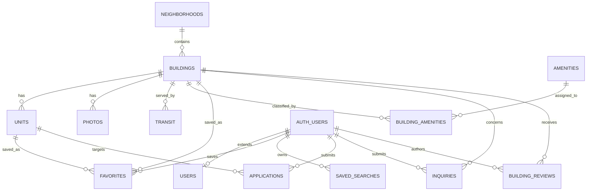

# NoFeeGo Database Architecture V2

| Version | Date | Status | Owner |
| --- | --- | --- | --- |
| 2.0 | 2026-07-31 | Active implementation specification | Data & Engineering |

## Purpose

V2 expands the existing Supabase schema without replacing V1 tables or IDs. It supports 5,000+ buildings, 100,000+ units, SEO routes, Google Maps, AI retrieval, Admin CMS and future API/mobile clients. The executable contract is `supabase/migrations/20260731000100_database_v2.sql`; the complete field inventory remains in `12_Data_Dictionary.md`.

## Compatibility Strategy

- `buildings.id` remains the internal UUID. Imported `BLD-xxxxx` values use unique `buildings.building_id`; neither is regenerated.
- Existing `name`, `address`, `floors`, `hero_image`, `contact_phone` and `contact_email` remain available. A trigger synchronizes V2 counterparts.
- Existing `listings` remains operational. V2 backfills `units.legacy_listing_id` so migration can be verified before consumers switch.
- V2 is expand-only. Removing legacy columns requires a later migration after dual-read comparison and rollback window.

## ER Diagram



## Table Descriptions

| Table | Role | Key decisions |
| --- | --- | --- |
| `buildings` | Canonical building master | UUID PK, unique external ID and slug, compatibility fields, source/verification metadata |
| `units` | Scalable unit availability | Building FK uses `RESTRICT`; optional unique Listing mapping; indexed rent/bed/date/status |
| `amenities` | Controlled vocabulary | Existing table retained |
| `building_amenities` | Many-to-many | Composite PK; junction rows cascade with either parent |
| `photos` | Ordered media | Cascades with Building; one hero per Building |
| `neighborhoods` | Geographic/SEO directory | Existing IDs/slugs preserved; borough/name unique; soft-active flag |
| `transit` | Verified proximity | Cascades with Building; station unique per Building |
| `favorites` | Existing saved Listing plus optional Building/Unit | Existing columns preserved; new FKs additive |
| Future placeholders | `users`, `applications`, `saved_searches`, `inquiries`, `building_reviews` | RLS enabled; inaccessible until explicit product/legal policies, except self-owned saved searches |

## Relationships and Delete Rules

- Neighborhood deletion continues to set Building neighborhood FK null for V1 compatibility.
- Building deletion is restricted while Units exist, preventing accidental inventory loss.
- Photos, Transit and junction rows cascade with their Building.
- User deletion cascades preferences/reviews; Applications/Inquiries use `SET NULL` to retain non-identifying operations.
- Public policies expose only active Units and non-sensitive reference data.

## Index Strategy

- Buildings: unique slug/external ID/Google Place ID; B-tree name, borough and neighborhood; partial active; composite coordinates; GIN keywords.
- Units: building; composite building/status/rent/bedrooms/date; partial active availability; unique non-null building/unit number.
- Photos and Transit use building-leading indexes; Transit lines use GIN.
- New indexes require measured query evidence; avoid redundant single-column indexes.

## Importer

`scripts/import-buildings.ts` reads `.xlsx`, `.xlsm` or `.csv`, validates eight identity/source fields, preserves ZIP/external IDs as text, validates coordinates, generates deterministic slugs, rejects duplicate source IDs/slugs and writes a JSON summary. It defaults to dry-run.

```powershell
pnpm import:buildings Database/building_expansion_20260731/Developer_Master.xlsx
pnpm import:buildings Database/building_expansion_20260731/Developer_Master.xlsx --commit --report=import-summary.json
```

Committed imports require server-only `SUPABASE_URL` and `SUPABASE_SERVICE_ROLE_KEY`.

## Deployment, Rollback and Scalability

1. Back up production and record Building/Listing row counts and ID checksums.
2. Apply the additive migration in staging, then production.
3. Run dry-run and resolve validation errors before `--commit`.
4. Compare V1/V2 names, addresses, counts and Listing→Unit mappings; monitor constraint/RLS errors.
5. Switch readers incrementally. Rollback returns readers to V1 and disables V2 writes; do not drop populated V2 structures during observation.

At 100,000 Units, building-leading B-tree indexes and keyset pagination are sufficient. Add PostGIS only when verified radius/polygon queries justify it; add pgvector only for versioned, source-backed knowledge chunks. Partition availability history only after measured growth.

## Related Documents

- [Canonical database architecture](02_Database_Architecture.md)
- [Data dictionary](12_Data_Dictionary.md)
- [Knowledge graph](11_Knowledge_Graph.md)
- [Development guidelines](08_Development_Guidelines.md)
